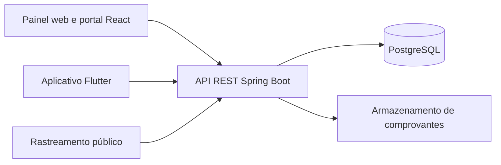

# JS Boy — Gestão de Entregas

Plataforma de gestão operacional para a **JS Boy**, empresa responsável por organizar entregas, entregadores, clientes, pagamentos e acompanhamento financeiro.

O projeto reúne três aplicações integradas:

- painel web administrativo e portal do cliente em React;
- API REST em Spring Boot;
- aplicativo operacional em Flutter.

> A JS Boy é a única empresa operadora do sistema. Não existem atendentes nem múltiplas empresas independentes. Os entregadores são funcionários da própria JS Boy e os clientes são as pessoas ou empresas que contratam o serviço.

## Principais recursos

### Proprietário

- dashboard com resumo da operação e atividades recentes;
- cadastro e gerenciamento de clientes e entregadores;
- criação de acessos vinculados a clientes e entregadores;
- criação, edição, designação e acompanhamento de entregas;
- histórico operacional, rastreamento e comprovantes;
- registro de pagamentos e estornos;
- relatórios e razão financeira;
- configuração de preços e dados da empresa;
- auditoria, usuários e operações de privacidade/LGPD.

### Entregador

- consulta somente das entregas vinculadas ao próprio usuário;
- avanço controlado dos status operacionais;
- registro de paradas, ocorrências e comprovantes;
- suporte a operações offline e posterior sincronização no aplicativo.

### Cliente

- consulta dos próprios dados, entregas e pagamentos;
- solicitação de entregas para análise da JS Boy;
- acompanhamento de paradas e comprovantes;
- rastreamento público por link seguro.

O perfil `FUNCIONARIO` existe somente como alias legado de `ENTREGADOR` e não deve ser usado para criar novos acessos.

## Tecnologias

| Camada | Tecnologias |
|---|---|
| Frontend web | React 18, TypeScript, Vite, React Router, React Hook Form, Zod, Axios e Vitest |
| Backend | Java 21, Spring Boot 3.3, Spring Security, Spring Data JPA, Flyway e JWT |
| Banco de dados | PostgreSQL 16 |
| Aplicativo | Flutter, Dart, Dio, Provider e armazenamento seguro |
| Infraestrutura | Docker Compose, Nginx e GitHub Actions |
| Observabilidade | Spring Boot Actuator, Prometheus e logs estruturados |

## Arquitetura



O backend é a fonte autoritativa das permissões. Ocultar uma ação no frontend melhora a experiência, mas toda autorização e todo vínculo de cliente ou entregador são novamente verificados pela API.

## Estrutura do repositório

```text
js-boy/
├── backend/                 # API Spring Boot, migrations e testes
├── frontend/                # painel web, portal e site público
├── mobile/                  # aplicativo Flutter canônico
├── docs/                    # operação, segurança, deploy e privacidade
├── ops/                     # arquivos auxiliares de infraestrutura
├── .github/workflows/       # CI, segurança, backup e deploy manual
├── docker-compose.yml       # ambiente local
├── docker-compose.prod.yml  # referência para produção
└── .env.example             # modelo de configuração local
```

> A pasta Flutter canônica é `mobile/`. A duplicidade de `lib/`, `test/` e `pubspec.yaml` na raiz foi preservada temporariamente para não eliminar trabalho existente.

## Executando com Docker

### Requisitos

- Git;
- Docker Desktop ou Docker Engine com Compose v2.

### 1. Clone o projeto

```bash
git clone <URL_DO_REPOSITORIO>
cd js-boy
```

### 2. Crie o arquivo de ambiente

No PowerShell:

```powershell
Copy-Item -LiteralPath .env.example -Destination .env
```

No Linux ou macOS:

```bash
cp .env.example .env
```

Preencha pelo menos estas variáveis no `.env`:

```dotenv
POSTGRES_DB=jsboy_local
POSTGRES_USER=jsboy_local
POSTGRES_PASSWORD=escolha-uma-senha-local

JWT_SECRET=use-um-segredo-com-no-minimo-32-caracteres
SEED_OWNER_EMAIL=seu-email@exemplo.com
SEED_OWNER_PASSWORD=escolha-uma-senha-forte
```

Não existem credenciais padrão. O e-mail e a senha iniciais do proprietário são exatamente os valores definidos em `SEED_OWNER_EMAIL` e `SEED_OWNER_PASSWORD` na primeira inicialização do banco.

Para gerar um segredo JWT no PowerShell:

```powershell
$jwtBytes = New-Object byte[] 48
[Security.Cryptography.RandomNumberGenerator]::Create().GetBytes($jwtBytes)
[Convert]::ToBase64String($jwtBytes)
```

### 3. Valide e inicie os serviços

```bash
docker compose config
docker compose up -d --build
docker compose ps
```

### 4. Acesse a aplicação

| Serviço | Endereço |
|---|---|
| Aplicação web | [http://localhost:5173](http://localhost:5173) |
| API | [http://localhost:8080](http://localhost:8080) |
| Health check | [http://localhost:8080/api/health](http://localhost:8080/api/health) |
| Swagger local | [http://localhost:8080/swagger-ui/index.html](http://localhost:8080/swagger-ui/index.html) |
| PostgreSQL | `localhost:5433` |

Use no login as credenciais configuradas nas variáveis `SEED_OWNER_EMAIL` e `SEED_OWNER_PASSWORD`.

## Comandos úteis do Docker

```bash
docker compose ps
docker compose logs -f frontend backend
docker compose up -d --build
docker compose down
```

O banco persiste no volume `postgres_data`. O comando `docker compose down` preserva os dados. Não use `docker compose down -v` sem ter certeza: ele remove o volume e apaga o banco local.

## Variáveis de ambiente

| Variável | Obrigatória | Finalidade |
|---|---:|---|
| `POSTGRES_DB` | Sim | Nome do banco local |
| `POSTGRES_USER` | Sim | Usuário do PostgreSQL |
| `POSTGRES_PASSWORD` | Sim | Senha do PostgreSQL |
| `JWT_SECRET` | Sim | Assinatura dos tokens; mínimo de 32 caracteres |
| `SEED_OWNER_EMAIL` | Sim | E-mail inicial do proprietário |
| `SEED_OWNER_PASSWORD` | Sim | Senha inicial do proprietário |
| `CORS_ALLOWED_ORIGINS` | Não | Origens autorizadas a chamar a API |
| `BACKEND_BIND_ADDRESS` | Não | Interface da API; padrão `127.0.0.1` |
| `BACKEND_PORT` | Não | Porta da API; padrão `8080` |
| `FRONTEND_BIND_ADDRESS` | Não | Interface do painel; padrão `127.0.0.1` |
| `FRONTEND_PORT` | Não | Porta do painel; padrão `5173` |
| `VITE_API_URL` | Não | URL da API usada no build do frontend |
| `VITE_BUSINESS_*` | Não | Contatos comerciais exibidos no site público |

Consulte [.env.example](.env.example) para todas as opções de desenvolvimento. Nunca versione o arquivo `.env` preenchido.

## Desenvolvimento sem Docker

### Backend

Requisitos: Java 21 e Maven.

```powershell
Set-Location backend
$env:SPRING_PROFILES_ACTIVE = "local"
$env:JWT_SECRET = "segredo-local-com-32-ou-mais-caracteres"
$env:SEED_OWNER_EMAIL = "seu-email@exemplo.com"
$env:SEED_OWNER_PASSWORD = "sua-senha-local-forte"
$env:CORS_ALLOWED_ORIGINS = "http://localhost:5173"
mvn spring-boot:run
```

Sem variáveis de PostgreSQL, o perfil local pode usar H2 em arquivo para desenvolvimento.

### Frontend

Requisitos: Node.js 18 ou superior.

```bash
cd frontend
npm ci
npm run dev
```

## Aplicativo Flutter

Requisitos:

- Flutter estável com Dart 3.3 ou superior;
- Android Studio/SDK ou dispositivo físico configurado;
- `flutter doctor` sem erros impeditivos.

```bash
cd mobile
flutter pub get
flutter analyze
flutter test
```

### Emulador Android

O endereço `10.0.2.2` aponta para o computador hospedeiro:

```bash
flutter run --dart-define=API_URL=http://10.0.2.2:8080
```

### Celular físico via USB

1. Conecte computador e celular à mesma rede.
2. Ative as opções de desenvolvedor e a depuração USB.
3. No `.env`, altere temporariamente:

```dotenv
BACKEND_BIND_ADDRESS=0.0.0.0
```

4. Reconstrua o backend e libere a porta `8080` apenas na rede privada do firewall.
5. Descubra o IPv4 do computador com `ipconfig`.
6. Execute usando esse endereço:

```bash
cd mobile
flutter devices
flutter run --dart-define=API_URL=http://SEU_IPV4:8080
```

Em produção, utilize sempre uma API HTTPS. O tráfego HTTP em texto aberto deve ficar restrito a builds de desenvolvimento.

## Testes

### Backend

```powershell
Set-Location backend
$env:SPRING_PROFILES_ACTIVE = "test"
mvn clean verify
```

### Frontend

```bash
cd frontend
npm ci
npm test
npm run build
```

### Flutter

```bash
cd mobile
flutter pub get
flutter analyze
flutter test
flutter build apk --debug
```

O workflow de integração contínua executa essas validações em pushes e pull requests.

## Segurança

- autenticação com access token e refresh token;
- senhas armazenadas com hash, nunca recuperáveis em texto puro;
- bloqueio temporário após falhas repetidas de login;
- autorização por perfil e vínculo validada no backend;
- idempotência nas operações financeiras e offline;
- auditoria operacional sem registrar senhas ou tokens;
- Swagger e console H2 desabilitados no perfil de produção;
- segredos de produção devem ficar em um gerenciador de segredos.

## Documentação adicional

- [Execução local](docs/execucao-local.md)
- [Matriz de permissões](docs/matriz-permissoes.md)
- [Deploy de produção](docs/deploy-producao.md)
- [Homologação e release mobile](docs/homologacao-release-mobile.md)
- [Backup e restauração](docs/backup-restauracao.md)
- [Monitoramento e alertas](docs/monitoramento-alertas.md)
- [Segurança de sessão](docs/seguranca-sessao.md)
- [Privacidade e termos preliminares](docs/privacidade-termos-preliminares.md)
- [Resposta a incidentes](docs/resposta-incidentes.md)

## Solução de problemas

### `POSTGRES_DB is missing a value`

O arquivo `.env` não existe ou está incompleto. Copie `.env.example`, preencha os campos obrigatórios e execute:

```bash
docker compose config
docker compose up -d --build
```

### A página abre em branco

Confira o estado e os logs:

```bash
docker compose ps
docker compose logs --tail=200 frontend backend
```

Depois reconstrua o frontend e atualize o navegador com `Ctrl + F5`.

### O aplicativo não acessa a API no celular

Confirme que:

- o celular e o computador estão na mesma rede;
- `BACKEND_BIND_ADDRESS=0.0.0.0` foi aplicado somente no ambiente local;
- o aplicativo recebeu `API_URL=http://SEU_IPV4:8080`;
- o firewall permite a porta `8080` na rede privada;
- a API aparece como saudável em `docker compose ps`.

## Status do projeto

O projeto está em evolução. Antes de uma operação pública, revise a configuração de produção, os provedores externos, o armazenamento de arquivos, os backups e os documentos jurídicos aplicáveis.
