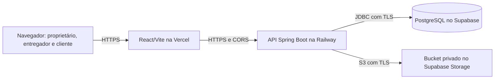

# Arquitetura alvo da entrega web + API

Decisão registrada em 02/10/2026 a partir de
`JS_BOY_ARQUITETURA_E_PLANO_DE_ENTREGA_2026.md` e das escolhas de Caio. Este
documento descreve o destino da entrega web; não atesta que os serviços já
estejam configurados ou publicados. O estado verificável está no
[backlog](backlog-estabilizacao-web-api.md).

## Topologia escolhida

A API continua sendo a única autoridade para identidade, permissões, status,
preços, saldo, estornos, fechamento e comprovantes. O navegador usa os endpoints
atuais. Não há migração para Supabase Auth nem acesso direto do bundle React ao
banco ou ao Storage. O projeto segue com uma API Spring Boot; a mudança de
provedores não cria microserviços.

## Decisões e limites

| Tema | Decisão | Verificação pendente |
|---|---|---|
| Web | Projeto Vercel com root `frontend/`, `VITE_API_URL` HTTPS e `vercel.json` para rotas React e cabeçalhos. | Conferir projeto, domínio, variáveis, rotas diretas e cabeçalhos em deployment de teste. |
| API | Serviço Railway com root `backend/`, Java 21 e uma instância inicialmente. | Confirmar build, health, TLS confiável, CORS e segredos separados por ambiente. |
| Banco | Novo PostgreSQL Supabase vazio, usado somente pela API. Flyway é a fonte única das migrations de negócio. | Criar/identificar projeto, ler histórico aplicado, obter backup verificável antes de mexer em migrations existentes; testar conexão, SSL, grants, RLS/Data API e pool. |
| Comprovantes | Bucket privado Supabase Storage via adaptador S3 no backend. Download continua autorizado pela API. | Testar bucket real, acesso negado, upload, download, exclusão, reconciliação e recuperação dos bytes. |
| Identidade | JWT, refresh tokens e regras de vínculo atuais permanecem na API. | Homologar sessões, recuperação e papéis no domínio final. |
| Escala | Uma instância da API até medir carga e centralizar limitadores. | Medir pool, fila de notificações, locks financeiros e limites por origem antes de criar réplicas. |
| Release | Mesmo commit deve passar CI web/API e infraestrutura; preparar artefato identificável antes de promover. | Executar gate remoto e homologação; publicação é etapa posterior. |

As credenciais do PostgreSQL e as chaves S3 pertencem somente à configuração da
API. As chaves S3 de servidor ignoram as políticas RLS do Storage, por isso o
bucket precisa ser privado e a autorização de cada arquivo deve continuar na
API. O backup do PostgreSQL guarda metadados, mas não os bytes dos arquivos:
ambos precisam de cópia e restauração verificadas separadamente.

## Sequência de preparação

1. Fechar as correções locais de comportamento e segurança, mantendo cada tipo
   de mudança identificável. Executar testes de permissões, idempotência,
   financeiro, status e comprovantes.
2. Criar o projeto Supabase novo. Antes de qualquer alteração em migrations
   existentes, registrar `flyway_schema_history` e um backup verificável.
   Não usar `repair`, `baseline` ou limpeza para contornar falhas.
3. Configurar banco e bucket de homologação separados dos de produção. Testar
   conexão Railway–Supabase, Storage e restauração completa.
4. Conectar a web Vercel à API Railway por HTTPS. Confirmar CORS, rotas diretas,
   headers, links de recuperação e fluxos do entregador no navegador.
5. Rodar CI no commit candidato e homologar os cenários do backlog. Só então
   preparar a promoção autorizada do mesmo artefato.

Os runbooks [Railway antigo](deploy-railway-staging.md) e
[Compose de produção](deploy-producao.md) documentam a topologia anterior;
suas instruções de PostgreSQL e volume local não devem ser aplicadas ao destino
acima sem revisão. Nenhum ambiente antigo deve ser apagado como atalho.
