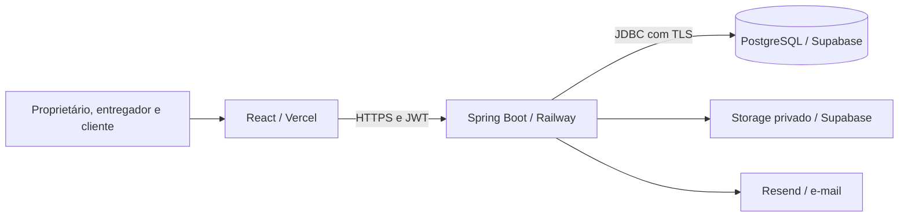
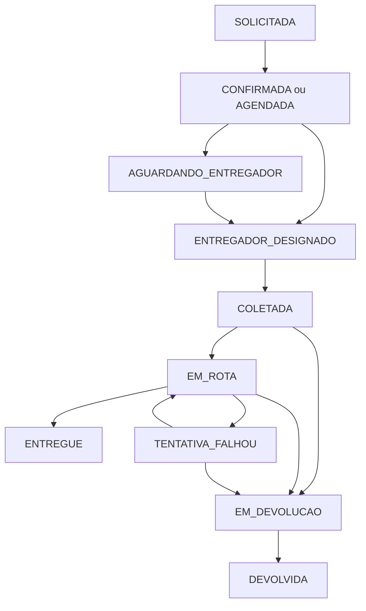

# Como o JS Boy funciona

Revisão em 08/10/2026, horário de Fortaleza. Descreve o código local revisado; a situação dos provedores publicados precisa ser conferida na homologação. Consulte também [a revisão e suas pendências](revisao-completa-2026-10-08.md) e [o procedimento de publicação](publicacao-vercel-railway-supabase.md).

## 1. Proposta do produto

O JS Boy organiza a operação de uma única empresa de entregas. O proprietário administra clientes, entregadores, solicitações, rotas, preços e financeiro. O entregador executa as entregas que recebeu. O cliente solicita e acompanha seus serviços. O site público apresenta a empresa, recebe contatos e oferece rastreamento por link.

É um sistema de gestão operacional com uma API própria. O código não implementa uma plataforma de múltiplas empresas, marketplace de entregadores, folha salarial, emissão fiscal, consulta bancária automática ou GPS em tempo real. Essas funcionalidades não devem ser prometidas na apresentação comercial.

## 2. Arquitetura e estrutura

| Pasta | Responsabilidade |
| --- | --- |
| `frontend/src/pages` | Telas públicas, administrativas, operacionais e portal |
| `frontend/src/components` | Elementos reutilizados, editor de rota e operação/recebimento |
| `frontend/src/contexts` | Sessão e mensagens de feedback |
| `frontend/src/routes` | Proteção e redirecionamento por perfil |
| `frontend/src/services` | HTTP, renovação da sessão, erros e tentativas financeiras |
| `backend/.../controller` | Contratos HTTP, validação de entrada e papéis permitidos |
| `backend/.../service` | Regras de preço, entrega, autorização, pagamentos e demais módulos |
| `backend/.../repository` | Consultas e locks no banco, usando JPA |
| `backend/.../entity` | Modelo persistente e relacionamentos |
| `backend/.../dto` e `mapper` | Dados de entrada/saída; evitam devolver entidades inteiras |
| `backend/.../security` e `config` | JWT, vínculos, filtros, infraestrutura e provedores |
| `backend/src/main/resources/db/migration` | Evolução do banco por Flyway |
| `.github/workflows` | Testes, auditorias, preparo de release e ensaio de backup |
| `ops` | Modelos de variáveis e scripts operacionais |
| `devpilot` | Orientações do agente e memória de decisões; não é parte do runtime do produto |
| `mentoria` | Material de estudo histórico; não determina o comportamento publicado |

A separação Controller → Service → Repository é adequada à dimensão atual. PostgreSQL e Storage ficam atrás da API. Não há necessidade de microserviços para esta entrega.

## 3. Pessoas, contas e permissões

`Usuario` representa a conta; `Cliente` e `Entregador` representam os cadastros operacionais. Ter um cadastro não significa ter acesso: o proprietário cria e vincula a conta separadamente. Desativar o cadastro também bloqueia o acesso correspondente e revoga as sessões de renovação.

| Perfil | O que faz |
| --- | --- |
| PROPRIETARIO | Administra operação, cadastros, preços, designação, financeiro, usuários e privacidade |
| ENTREGADOR | Consulta e executa somente entregas atribuídas ao seu vínculo ativo; confirma recebimentos próprios |
| CLIENTE | Consulta dados e entregas próprios, solicita serviços e acompanha pagamento; não confirma recebimento |
| FUNCIONARIO | Alias legado: só recebe permissões de entregador quando possui vínculo válido |

O proprietário pode administrar o recebimento de uma entrega executada por ele sem criar outra conta de usuário. A entrega ainda precisa apontar para o cadastro do entregador que efetivamente recebeu; isso identifica o destinatário do pagamento.

## 4. Sessão e segurança

Login autentica a senha com BCrypt e emite JWT de curta duração. O access token fica na memória da página; dados mínimos da conta ficam no `localStorage`. O refresh token fica em cookie HttpOnly, Secure, SameSite=Strict e é armazenado no banco somente como hash. A renovação rotaciona o token; reutilização de token revogado invalida sua família.

Recarregar a página consulta `/auth/me` e renova o acesso quando necessário. Logout revoga a renovação e limpa a sessão local e as tentativas financeiras. Trocar/desativar a identidade impede que um JWT antigo continue autorizando operações.

A recuperação de senha usa token aleatório, expirável e de uso único, com limitação de solicitações. O provedor `local` não entrega e-mail; homologação real precisa do Resend configurado. Senhas novas exigem pelo menos 12 caracteres e respeitam o limite BCrypt de 72 bytes, incluindo acentos.

O frontend esconde ações conforme o perfil, mas a API verifica papel, vínculo e propriedade novamente. CORS, CSP, headers e TLS complementam essa autorização. CORS não substitui autenticação.

## 5. Cadastros e apresentação comercial

Clientes guardam identificação, contato e endereço estruturado. Entregadores guardam identificação, veículo, disponibilidade e dados Pix. CPF/CNPJ, telefone e endereço têm validações; e-mail Pix não recebe máscara numérica.

Configuração da empresa define dados apresentados no portal e no acompanhamento. Os contatos do site público são configurados no build com `VITE_BUSINESS_*`; mudar os dados administrativos não recompila o site automaticamente. Por isso os dois conjuntos precisam ser conferidos antes de publicar.

O formulário público gera uma solicitação de contato para tratamento administrativo. Ele não cria uma conta nem aceita automaticamente um contrato de entrega. O acesso inicial permanece controlado pelo proprietário.

## 6. Solicitação, preço e entrega

O cliente solicita sem escolher outro cliente, preço final, status ou entregador. A API usa seu vínculo e registra SOLICITADA. O proprietário revisa, informa o valor acordado quando necessário, confirma/agenda e designa o entregador.

Preço usa a tabela por bairro/área e tipo de veículo. Existem áreas com valor negociado e cálculo alternativo por distância, com mínimo. Retorno e espera seguem as taxas configuradas; espera conta blocos completos de 30 minutos. A entrega guarda os valores aplicados para que uma alteração futura da tabela não reescreva o histórico.

Uma rota com vários locais exige um valor negociado explícito para o conjunto, sem taxa nova por parada. Alterar manualmente o valor final precisa de justificativa. Solicitação que ainda depende de orçamento não pode ser aprovada como gratuita por causa do zero usado na estimativa inicial. O proprietário pode autorizar zero de forma explícita.

## 7. Estados e execução

Cancelamento só ocorre antes da coleta. Falhas operacionais definitivas também encerram o fluxo. ENTREGUE, DEVOLVIDA, FALHA_OPERACIONAL e CANCELADA são terminais. O servidor controla as transições; selecionar um status arbitrário não permite ignorar as regras.

O status da entrega e o status de cada parada são coisas diferentes. COLETADA/EM_ROTA descrevem a etapa geral; concluir uma parada registra a execução daquele local. A última parada não finaliza sozinha a entrega.

O código `JSB-...` guardado no banco identifica o mesmo serviço no painel, no portal e para o entregador. A posição de uma linha na tabela não identifica uma entrega. O rastreamento público possui outro código e token próprios.

## 8. Rotas, paradas e ocorrências

A rota começa por coleta e termina por entrega; pode ter vários locais ordenados. Cada local contém endereço, número ou S/N, contato e observação. O editor permite adicionar, remover e reordenar antes da operação, conservando IDs dos locais mantidos e exigindo versões atualizadas.

Uma parada futura não ignora a anterior. A conclusão é manual e registra autor e horário. Ocorrência não desfaz uma conclusão já registrada. Tentativa frustrada conserva a pendência; o entregador retoma a rota e resolve o local antes de avançar. Foto, assinatura e OTP deixaram de ser exigências operacionais.

O backend dispõe de sincronização idempotente de status para clientes offline. A web desta entrega precisa de conexão e não oferece fila offline completa. Funcionalidades descritas em documentos antigos de Flutter não fazem parte desta publicação web.

## 9. Pix, dinheiro, saldo e finalização

Pix aponta para a chave do entregador designado. O cliente copia a chave e confere o destinatário no banco. Copiar ou visualizar não prova que houve crédito. No dinheiro, o recebedor confere o valor em mãos; nenhuma chave é apresentada.

Só o entregador autorizado ou o proprietário confirma o recebimento. O servidor registra `Pagamento` com valor, forma, responsável, recebedor e snapshots dos dados utilizados. Confirmação pode ser parcial. Saldo é valor final menos recebimentos líquidos de estornos.

Uma confirmação repetida com a mesma chave e dados devolve o mesmo lançamento. O servidor usa locks e limites de saldo; o navegador preserva a tentativa por conta/entrega inclusive após fechar a tela ou recarregar. Diante de resposta perdida, a ação **Conferir tentativa anterior** consulta o resultado pelo reenvio idempotente. Descartar uma tentativa exige conferência e não estorna pagamento.

Mudança de recebedor, preço ou forma após recebimento líquido exige estorno/conciliação explícita. Chave ou titular alterados invalidam uma consulta antiga antes de confirmar. Estornar reduz o crédito e pode retirar a liberação de finalização.

ENTREGUE exige EM_ROTA, entregador identificado, todos os locais concluídos e situação financeira regular. Valor zero dispensa crédito fictício, mas conserva as condições operacionais. As mesmas regras protegem chamadas diretas e sincronização offline.

Mercado Pago não emite cobranças novas. Consulta e webhook existem somente para reconciliar cobranças antigas. Pendência não é assumida como paga ou cancelada por vencimento local. Em banco novo sem cobranças, não há credenciais Mercado Pago obrigatórias.

## 10. Financeiro e relatórios

`Pagamento` guarda recebimentos/estornos ligados à entrega. `LancamentoRazao` guarda despesas, taxas, repasses e ajustes. O relatório combina essas fontes sem permitir criar receita ou estorno avulso pelo módulo de despesas.

Faturamento por competência considera serviços concluídos; caixa considera a data do movimento financeiro. Esses números podem diferir. Fechamento bloqueia novos movimentos no período; reabertura exige motivo e auditoria. Não se apagam recebimentos para corrigir saldo: usa-se estorno.

**Meu faturamento** mostra ao entregador o valor dos serviços que executou. Não calcula salário, comissão ou valor que a empresa deva pagar a ele. Pagamento direto recebido pelo entregador também não implica transferência automática para uma conta bancária da empresa. A conciliação física do dinheiro e dos créditos permanece responsabilidade da JS Boy.

Devolução/falha não zera automaticamente o financeiro de um serviço. Regras comerciais de cobrança/refund nesses casos precisam ser aplicadas pelo responsável.

## 11. Rastreamento, mensagens, auditoria e privacidade

Rastreamento público apresenta estados/timeline e contato da empresa. O token é aleatório, pode expirar e ser revogado; não revela Pix, valores, destinatário completo ou GPS.

Notificações usam outbox transacional com tentativas posteriores. `local` registra metadados para desenvolvimento; Resend realiza o envio real. Aceitação pelo provedor não garante leitura na caixa de entrada. Nenhuma cobrança bancária é automatizada por uma notificação.

Auditoria guarda quem realizou mudanças, quando e quais dados operacionais foram alterados. Privacidade oferece exportação cadastral/financeira e anonimização do cadastro com desativação da conta. Isso não apaga automaticamente endereços e documentos históricos das entregas; retenção do acervo exige política aprovada e revisão dos dados envolvidos. O recurso técnico não equivale à conclusão de conformidade jurídica.

## 12. Banco, arquivos e publicação

Flyway aplica migrations em ordem; JPA valida o esquema em vez de criá-lo livremente. V18 adiciona recebimento direto e paradas manuais; V19 ativa RLS e retira acesso dos papéis públicos às tabelas de negócio. O JDBC precisa usar seu papel proprietário autorizado. Nunca usar `anon`/`authenticated` para a API Spring ou chaves de servidor no bundle React.

O bucket Supabase é privado. Downloads de comprovantes antigos continuam passando pela autorização da API. Nenhuma exigência nova de upload/OTP é imposta à operação. Backup do PostgreSQL não contém os bytes do bucket; as duas fontes precisam de recuperação coordenada quando há acervo.

A preparação manual de release exige os gates de qualidade e segurança. Ela gera artefatos; não publica o sistema. Homologação precisa testar os domínios e os provedores reais com as mesmas versões que serão promovidas. Testes locais aprovados são evidência do código, não prova da configuração final da Vercel, Railway ou Supabase.

## 13. Mapa das telas

| Tela/área | Finalidade e acesso |
| --- | --- |
| Site, serviços, como funciona, empresas e contato | Apresentação pública e pedido de contato; não cria acesso automático |
| Login, esqueci senha, redefinir senha | Entrada para os três perfis e recuperação de conta |
| Dashboard | Resumo administrativo: andamento, conclusão, valores e ações recentes |
| Clientes | Cadastro operacional, aprovação/ativação e criação de acesso vinculado |
| Entregadores | Cadastro, veículo/disponibilidade, Pix e criação de acesso |
| Entregas | Criação, busca, edição anterior à execução, preço, designação, histórico e operação |
| Pagamentos | Consulta e registro administrativo de recebimentos/estornos; integra saldo da entrega |
| Financeiro | Despesas, taxas, repasses, ajustes, razão e fechamento/reabertura justificada |
| Relatórios | Visões administrativas operacionais/financeiras e exportação PDF |
| Configuração de preço | Valores por bairro/área/veículo, distância, mínimo, espera e retorno |
| Configuração da empresa | Contato/dados administrativos exibidos ao cliente/rastreamento |
| Usuários | Contas, perfis, vínculos e ativação; senha nunca pode ser consultada |
| Auditoria | Consulta administrativa do histórico de mudanças/responsáveis |
| Privacidade | Solicitações do titular, exportação e anonimização cadastral com os limites descritos acima |
| Minhas entregas | Painel do entregador: serviços próprios, avanço, paradas, ocorrência e recebimento |
| Meu faturamento | Consulta do entregador sobre volume/valor dos serviços executados |
| Portal | Cliente consulta cadastro/serviços, solicita entrega, acompanha rota, forma/saldo e preferências |
| Rastreamento | Consulta pública limitada pelo token do link, sem acesso à área financeira |
| Política de privacidade | Texto público sobre uso dos dados, cookie essencial e canal de atendimento |

Recorrências são administradas pelos contratos da API; não há uma tela independente de recorrências na navegação atual. O site abre mapas/contatos externos quando previsto; isso não cria monitoramento GPS. Rotas protegidas redirecionam por perfil e a API aplica a autorização novamente.
